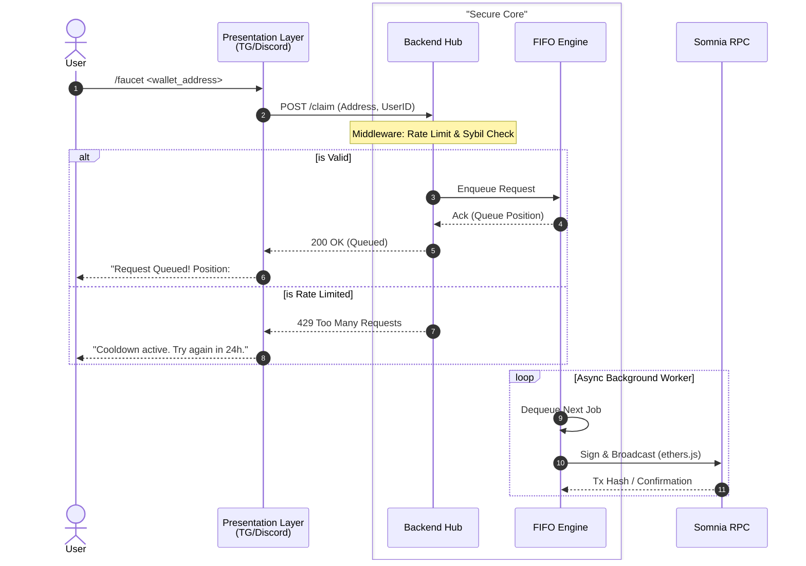

# Somnia Faucet Suite: System Architecture

## Overview

The Somnia Faucet Suite is a modular, high-availability Web3 infrastructure tool designed to distribute testnet tokens on the Somnia Network. The system adopts a **decoupled architecture**, separating user-facing presentation layers (Telegram, Discord) from the core transactional logic. This ensures high concurrency handling, nonce integrity, and robust system monitoring.

## Architectural Design Philosophy

1.  **Separation of Concerns:** The core business logic is isolated within the Backend service. Interface bots act strictly as clients, ensuring the system can scale to new platforms (e.g., Web UI, CLI) without refactoring the core distribution logic.
2.  **Serialized Execution:** To handle the strict sequential nature of Ethereum-based nonces, the system employs a rigid FIFO (First-In-First-Out) queuing mechanism.
3.  **Observability:** Integrated health checks and analytics provide real-time visibility into system performance and user engagement.

---

## System Components

### 1. Presentation Layer (Interfaces)

The entry points for user interaction. These services are stateless and function as gateways to the core backend.

- **Telegram Bot (`/tg-bot`):** Utilizes webhooks/polling to capture user commands and interacts with the Backend via REST API.
- **Discord Bot (`/discord-bot`):** Listens for slash commands interaction events and forwards validated requests to the Backend.

### 2. Core Infrastructure (`/backend`)

The monolithic hub responsible for state management, blockchain interaction, and request processing.

- **API Gateway:** Express.js server handling incoming requests, rate limiting, and input validation.
- **FIFO Request Queue:** A memory-safe queuing system that linearizes concurrent requests to prevent nonce collisions.
- **Blockchain Adapter:** Wraps `ethers.js` to manage wallet signing, gas estimation, and RPC communication with the Somnia Network.
- **Persistence Layer:** Utilizes `LowDB` for lightweight, JSON-based storage of user statistics, cooldowns, and global configuration.

---

## Transaction Flow & Concurrency

To ensure transaction reliability on the Somnia EVM, the system must strictly manage the `nonce` of the faucet wallet.

### Sequence Diagram

The following diagram illustrates the flow of a user request from the interface to the blockchain.

### Nonce Collision Prevention

In high-concurrency environments, multiple requests attempting to use the same wallet nonce will result in transaction failures ("replacement transaction underpriced").

- **Solution:** All valid requests are pushed to a centralized **FIFO Queue**.
- **Execution:** A single worker consumes the queue, ensuring that Transaction $N+1$ is only broadcast after Transaction $N$ has been successfully submitted to the mempool, guaranteeing nonce linearity.

---

## Reliability & Monitoring

### Faucet Health Monitoring

To prevent silent failures (e.g., empty wallet, stuck nonce), the system includes a dedicated Health Check Service.

- **Mechanism:** A CronJob executes every **5 hours**.
- **Checks:**
  Verifies the Faucet Wallet balance is above the minimum threshold.
- **Alerting:** An alert is dispatched to the Admins on telegram via the admin telegram ID's in tg-bot/config/admins.ts file.

### Error Recovery

- **RPC Failures:** The blockchain adapter includes retry logic for intermittent RPC timeouts.
- **Queue Persistence:** Queue persistence across server restarts via LowDB.

---

## Developer Analytics

The system tracks interaction metrics to provide insights into testnet adoption and tool usage.

- **Unique Wallet Tracking:** Database records ensure distinct wallet addresses are counted, preventing inflation of stats by repeat users.
- **Interaction Volume:** Logs total successful claims.
- **Time-Series Data:** timestamps allow for analysis of peak usage times, aiding in infrastructure scaling decisions.

---

## Tech Stack

- **Runtime:** Node.js (TypeScript)
- **Blockchain Framework:** Ethers.js
- **Database:** LowDB (JSON)
- **Interfaces:** Telegraf (Telegram), Discord.js (Discord)
