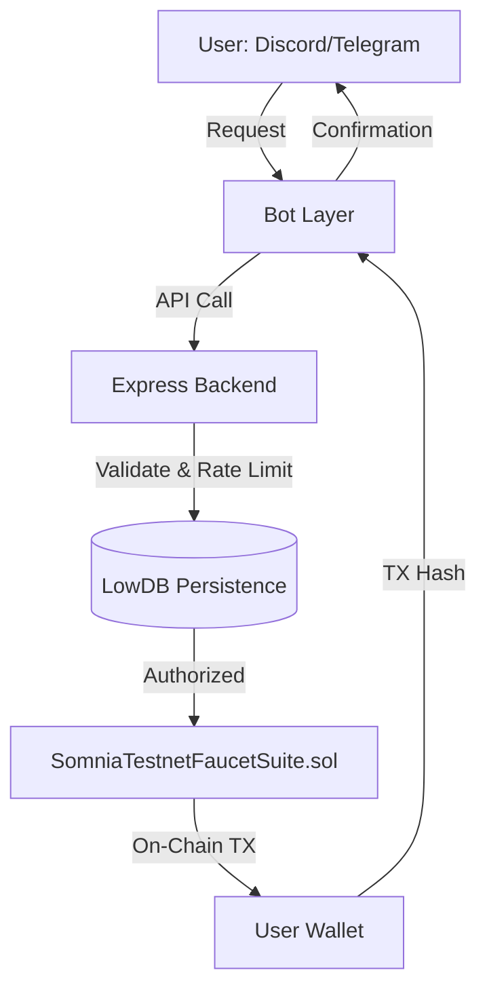

# Somnia Faucet Suite


The ultimate automated onboarding solution for the Somnia Ecosystem.

The Somnia Faucet Suite is a multi-channel, production-grade infrastructure tool designed to eliminate manual testnet token requests. By integrating Discord, Telegram, and a secure backend API, it provides a seamless "Day 1" experience for developers joining the Somnia Shannon Testnet.

### Key Features

Multi-Channel Entry: Seamless integration for Discord (/faucet slash commands) and Telegram (! commands).

Sybil Protection:
Sybil Resistance Engine: Dual-layer validation using wallet-binding and unique Social ID to prevent liquidity draining.

Multi-Asset Support: Native $STT and ERC20 (USDC) distribution from a single smart contract.

Developer-First API: Clean REST endpoints for external tool integration.

Decoupled Execution Architecture:" The core logic is isolated from the bot interfaces, allowing for sub-second ingestion and asynchronous on-chain execution via a FIFO queue.

## Architecture

The project is managed as a high-performance pnpm monorepo to ensure type safety and easy deployment across services.



contracts: Foundry-based smart contracts for secure, owner-managed token distribution.

backend: The central brain; handles Ethers.js providers and security logic.

discord-bot: Modern Discord.js implementation with slash command support.

tg-bot: Lightweight Telegraf-based bot for community groups.

### Quick Start

Prerequisites:
Node.js (v18+) & pnpm

Foundry (for contract management)

### Installation

```Bash
git clone https://github.com/mykelbwan/somnia-faucet-suite.git
cd somnia-faucet-suite
pnpm install -r
```

### Environment Configuration

Each service requires a .env file. Key variables include:

Backend: RPC_PROVIDER, PRIVATE_KEY (Deployer), SMART_CONTRACT address.

Bots: DISCORD_BOT_TOKEN / TELEGRAM_BOT_TOKEN, and the MAIN_ENTRY (Backend URL).

````markdown
### Smart Contract Architecture

The `SomniaTestnetFaucetSuite.sol` utilizes an **Access Control** pattern to ensure only the authorized Backend Worker can trigger distributions.

- **Security:** Integrated `Ownable` and `ReentrancyGuard`.
- **Optimization:** Minimal state updates to ensure the lowest possible gas fees on Somnia.
- **Verification:** ```bash
  forge verify-contract <ADDRESS> SomniaFaucet --chain-id 12345 --watch
````

Note: Ensure the backend PRIVATE_KEY matches the contract owner to authorize token transfers.

### Usage Examples

Discord Command:

```Plaintext
/faucet token:STT wallet:0xYourWalletAddress
```

Telegram Command:

```Plaintext
!STT 0xYourWalletAddress
```

### Roadmap & Ecosystem Vision (2026)

My goal is to provide a unified Developer Experience (DX) Layer for Somnia.
The Faucet Suite is the foundation, with the following modules in development:

AI-Support Integration (In Progress): Integrating my Somnia **[DevAssist](https://github.com/mykelbwan/somnia-dev-assist)**, a RAG-based AI agent directly into the Discord/Telegram bots. This allows the suite to handle both token distribution and complex technical queries using official Somnia documentation.

Analytics Dashboard: A web-based interface for the DevRel team to monitor faucet health, track unique developer onboarding metrics.
